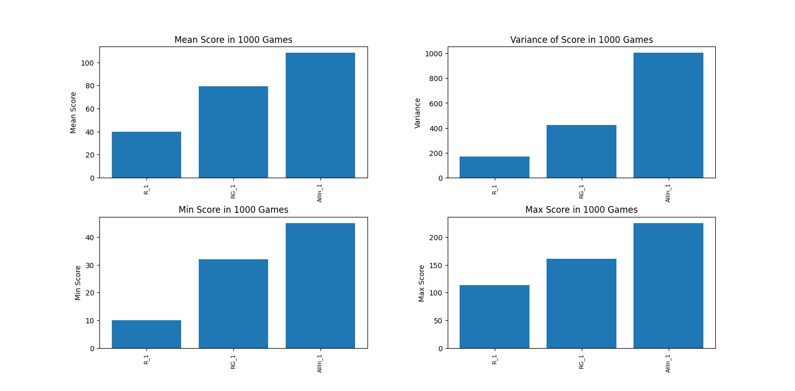
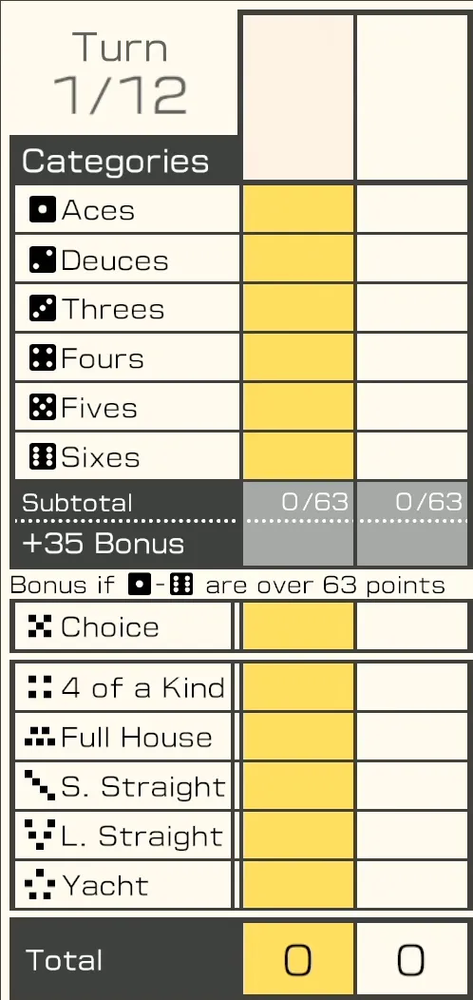

# Yacht Dice
> **주사위를 굴려 최고의 족보를 완성하자**

> [!NOTE]
> - [x] yacht CLI 구현
> - [ ] Heuristic 알고리즘 기반 player 구현
> - [ ] RL 기반 player 구현
> - [ ] Heuristic vs RL vs Human 실력 비교

https://github.com/user-attachments/assets/d44e0cbe-78ee-4f85-a227-5c8216f93344

## 알고리즘 성능 비교


- R (RandomPlayer): 주사위 선택 및 점수칸 선택이 모두 무작위
- RG (Random-Greedy Player): 주사위 선택은 무작위, 점수칸 선택은 Greedy
- AllIn Player: 주사위 선택 시 동일한 숫자가 가장 많도록 선택, 점수칸 선택은 Greedy

## 규칙
[참고링크](https://brainterrace.tistory.com/100)

1. 주사위 5개를 던진다.
2. 원하는 주사위들은 남겨두고, 나머지 주사위들을 다시 던진다.
    - 다시 던지기는 한 라운드에 2번까지(즉, 한 라운드에 최대 3번까지 던질 수 있다.) 가능.
    - 앞에서 던지지 않았던 주사위도 원한다면 다시 던질 수 있다.
3. 주사위 던지기가 끝난 후 나온 최종 조합으로 아직 기록되지 않은 족보 중 하나를 반드시 선택하여 점수를 기록한다.
    - 채울 수 있는 족보가 없거나 점수가 마음에 들지 않는 경우, 아직 채워지지 않은 족보의 점수 칸에 0점을 기록할 수 있다.
4. 모든 플레이어가 점수판을 모두 채우면 게임이 끝난다. 획득한 점수가 가장 높은 사람이 승리한다.

### Score Board
<br>
51 Worldwide Games에 수록된 Yacht Dice 점수판

## 실행 방법

1. 코드 다운로드

2. 경로 이동 후 main.py 실행
```sh
python ./main.py
```
